# [📈 Live Status](https://alejandroosunna.github.io/upptime): <!--live status--> **🟧 Partial outage**

This repository contains the open-source uptime monitor and status page for [Alejandro Osuna](https://alejandroosunna.github.io/upptime), powered by [Upptime](https://github.com/upptime/upptime).

With [Upptime](https://upptime.js.org), you can get your own unlimited and free uptime monitor and status page, powered entirely by a GitHub repository. We use [Issues](https://github.com/alejandroosunna/upptime/issues) as incident reports, [Actions](https://github.com/alejandroosunna/upptime/actions) as uptime monitors, and [Pages](https://alejandroosunna.github.io/upptime) for the status page.

<!--start: status pages-->
<!-- This summary is generated by Upptime (https://github.com/upptime/upptime) -->
<!-- Do not edit this manually, your changes will be overwritten -->
<!-- prettier-ignore -->
| URL | Status | History | Response Time | Uptime |
| --- | ------ | ------- | ------------- | ------ |
|  [staging01](https://staging01.algebraix.com/bin/g/start/default/?x_load=0) | 🟩 Up | [staging01.yml](https://github.com/alejandroosunna/upptime/commits/HEAD/history/staging01.yml) | 

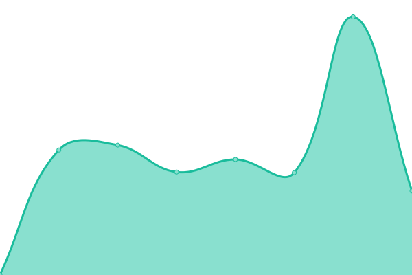 473ms
     
 | 

<a href="https://alejandroosunna.github.io/upptime/history/staging01">100.00%</a>
    

|  [staging02](https://staging02.algebraix.com/bin/g/start/default/?x_load=0) | 🟩 Up | [staging02.yml](https://github.com/alejandroosunna/upptime/commits/HEAD/history/staging02.yml) | 

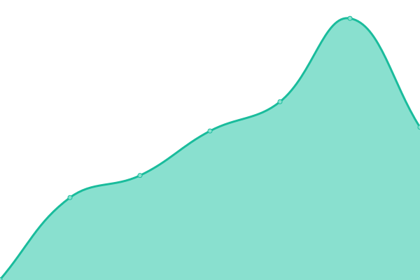 418ms
     
 | 

<a href="https://alejandroosunna.github.io/upptime/history/staging02">100.00%</a>
    

|  [staging03](https://staging03.algebraix.com/bin/g/start/default/?x_load=0) | 🟩 Up | [staging03.yml](https://github.com/alejandroosunna/upptime/commits/HEAD/history/staging03.yml) | 

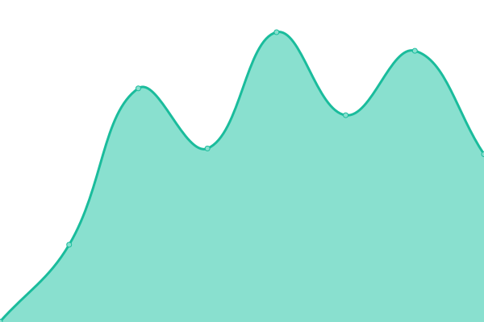 413ms
     
 | 

<a href="https://alejandroosunna.github.io/upptime/history/staging03">100.00%</a>
    

|  [staging04](https://staging04.algebraix.com/bin/g/start/default/?x_load=0) | 🟩 Up | [staging04.yml](https://github.com/alejandroosunna/upptime/commits/HEAD/history/staging04.yml) | 

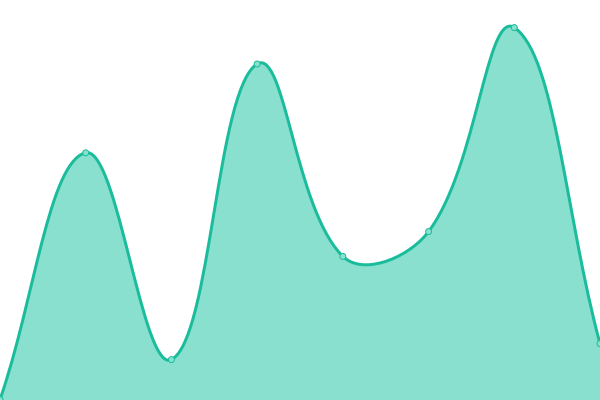 430ms
     
 | 

<a href="https://alejandroosunna.github.io/upptime/history/staging04">100.00%</a>
    

|  [staging05](https://staging05.algebraix.com/bin/g/start/default/?x_load=0) | 🟥 Down | [staging05.yml](https://github.com/alejandroosunna/upptime/commits/HEAD/history/staging05.yml) | 

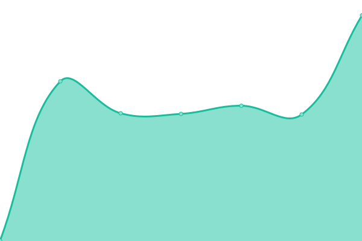 298ms
     
 | 

<a href="https://alejandroosunna.github.io/upptime/history/staging05">0.00%</a>
    

|  [staging06](https://staging06.algebraix.com/bin/g/start/default/?x_load=0) | 🟥 Down | [staging06.yml](https://github.com/alejandroosunna/upptime/commits/HEAD/history/staging06.yml) | 

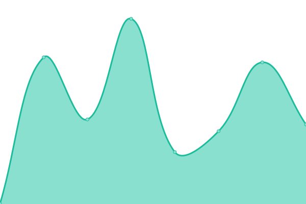 309ms
     
 | 

<a href="https://alejandroosunna.github.io/upptime/history/staging06">8.23%</a>
    

|  [staging07](https://staging07.algebraix.com/bin/g/start/default/?x_load=0) | 🟥 Down | [staging07.yml](https://github.com/alejandroosunna/upptime/commits/HEAD/history/staging07.yml) | 

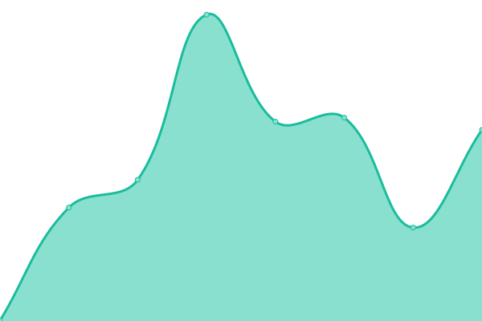 293ms
     
 | 

<a href="https://alejandroosunna.github.io/upptime/history/staging07">0.00%</a>
    

|  [staging08](https://staging08.algebraix.com/bin/g/start/default/?x_load=0) | 🟥 Down | [staging08.yml](https://github.com/alejandroosunna/upptime/commits/HEAD/history/staging08.yml) | 

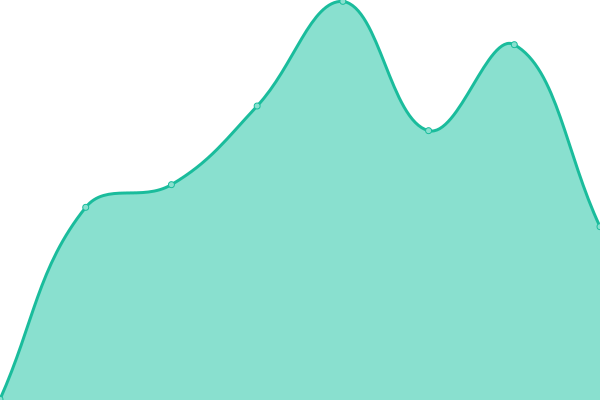 275ms
     
 | 

<a href="https://alejandroosunna.github.io/upptime/history/staging08">0.00%</a>
    

|  [staging09](https://staging09.algebraix.com/bin/g/start/default/?x_load=0) | 🟥 Down | [staging09.yml](https://github.com/alejandroosunna/upptime/commits/HEAD/history/staging09.yml) | 

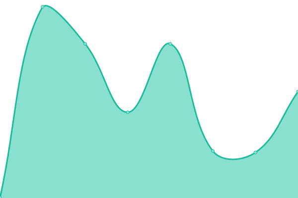 322ms
     
 | 

<a href="https://alejandroosunna.github.io/upptime/history/staging09">0.00%</a>
    

|  [staging10](https://staging10.algebraix.com/bin/g/start/default/?x_load=0) | 🟩 Up | [staging10.yml](https://github.com/alejandroosunna/upptime/commits/HEAD/history/staging10.yml) | 

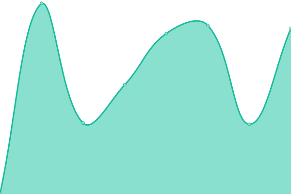 327ms
     
 | 

<a href="https://alejandroosunna.github.io/upptime/history/staging10">57.16%</a>
    

|  [staging11](https://staging11.algebraix.com/bin/g/start/default/?x_load=0) | 🟥 Down | [staging11.yml](https://github.com/alejandroosunna/upptime/commits/HEAD/history/staging11.yml) | 

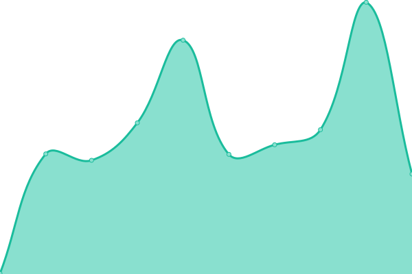 378ms
     
 | 

<a href="https://alejandroosunna.github.io/upptime/history/staging11">92.49%</a>
    

|  [staging12](https://staging12.algebraix.com/bin/g/start/default/?x_load=0) | 🟥 Down | [staging12.yml](https://github.com/alejandroosunna/upptime/commits/HEAD/history/staging12.yml) | 

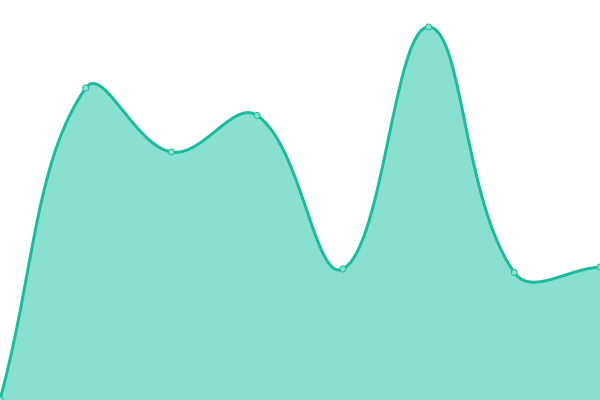 354ms
     
 | 

<a href="https://alejandroosunna.github.io/upptime/history/staging12">91.75%</a>
    

|  [staging13](https://staging13.algebraix.com/bin/g/start/default/?x_load=0) | 🟥 Down | [staging13.yml](https://github.com/alejandroosunna/upptime/commits/HEAD/history/staging13.yml) | 

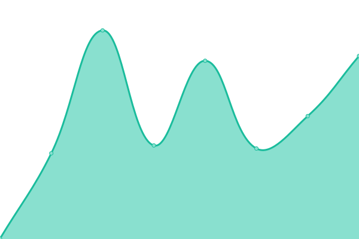 324ms
     
 | 

<a href="https://alejandroosunna.github.io/upptime/history/staging13">37.68%</a>
    

|  [staging14](https://staging14.algebraix.com/bin/g/start/default/?x_load=0) | 🟩 Up | [staging14.yml](https://github.com/alejandroosunna/upptime/commits/HEAD/history/staging14.yml) | 

 296ms
     
 | 

<a href="https://alejandroosunna.github.io/upptime/history/staging14">40.22%</a>
    

|  [staging15](https://staging15.algebraix.com/bin/g/start/default/?x_load=0) | 🟩 Up | [staging15.yml](https://github.com/alejandroosunna/upptime/commits/HEAD/history/staging15.yml) | 

 332ms
     
 | 

<a href="https://alejandroosunna.github.io/upptime/history/staging15">57.86%</a>
    

|  [staging16](https://staging16.algebraix.com/bin/g/start/default/?x_load=0) | 🟩 Up | [staging16.yml](https://github.com/alejandroosunna/upptime/commits/HEAD/history/staging16.yml) | 

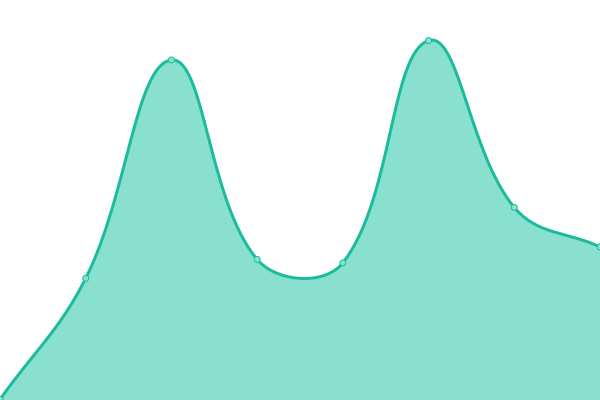 254ms
     
 | 

<a href="https://alejandroosunna.github.io/upptime/history/staging16">14.14%</a>
    

<!--end: status pages-->

[**Visit our status website →**](https://alejandroosunna.github.io/upptime)

## 📄 License

- Powered by: [Upptime](https://github.com/upptime/upptime)
- Code: [MIT](./LICENSE) © [Alejandro Osuna](https://alejandroosunna.github.io/upptime)
- Data in the `./history` directory: [Open Database License](https://opendatacommons.org/licenses/odbl/1-0/)
